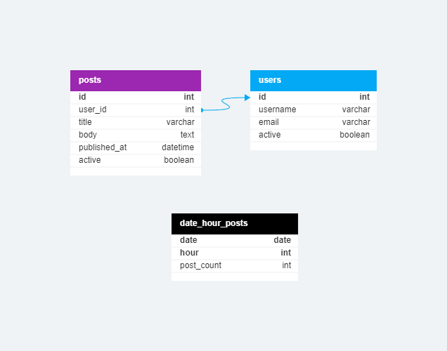

# Social Media Blog

This project is a social media-like blog developed in PHP and MySQL. It allows users to view a list of active users and their posts alongside a user image. The application retrieves data from JSONPlaceholder API, stores it in a MySQL database, and presents it in a user-friendly format.

## Features

- Fetches user data and posts from JSONPlaceholder API using cURL.
- Stores user data and post data in a MySQL database.
- Displays a list of active users along with their posts.
- Shows user images alongside their posts.

## Database Class

The project includes a `Database` class that provides a convenient and secure way to interact with the MySQL database using PHP's PDO (PHP Data Objects) extension. The class encapsulates common database operations such as selecting, inserting, updating, and deleting records.
The Database class handles errors that may occur during database operations. If an error occurs, an exception is thrown with a detailed error message.
The Database class uses prepared statements to prevent SQL injection attacks.

## Usage

- Upon accessing the application (index.php) the tables are created for users, posts, and date_hour_posts (a table that shows posts count for each date&hour). Also the image for the users is pulled (with curl) and saved on the server.
- Go to /get-users-into-table.php to pull users data from JSONPlaceholder API into the table.
- Go to /get-posts-into-table.php to pull posts data from JSONPlaceholder API into the table.
- Go to /get-data-into-date-hour-posts-table.php to pull the relevant data according to 'posts' table.
- Go to /select-active-users-and-posts.php to display a list of active users along with their posts and more data.

## Database's tables structure

